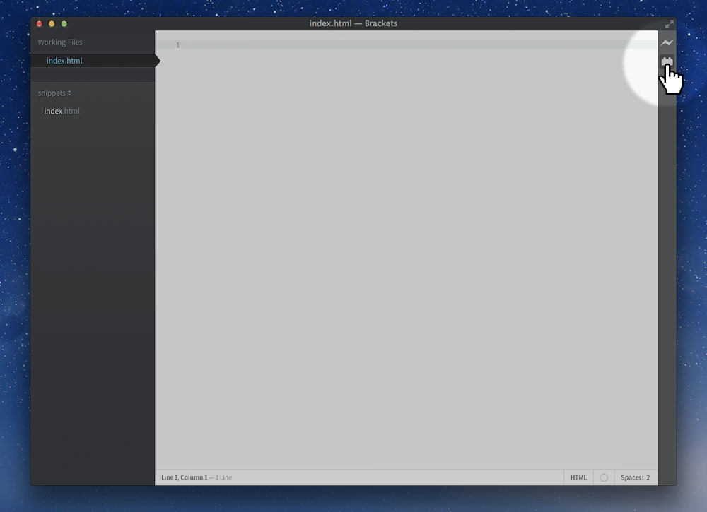
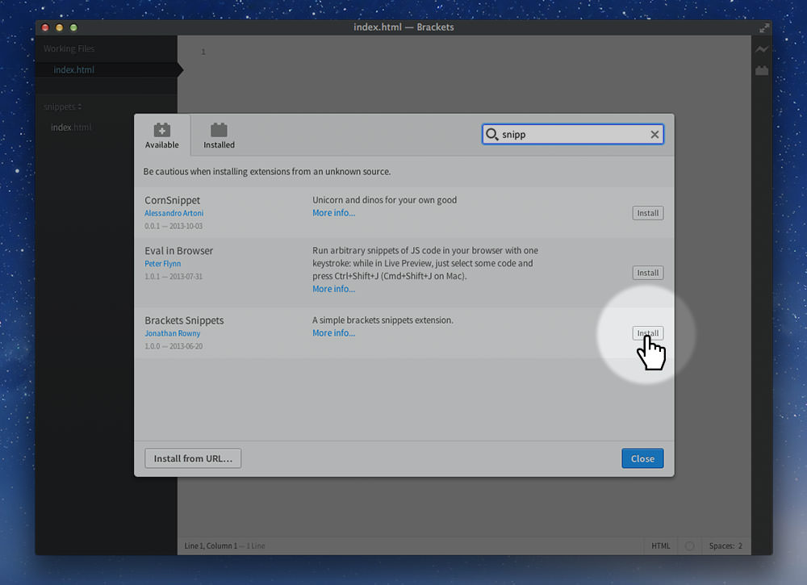
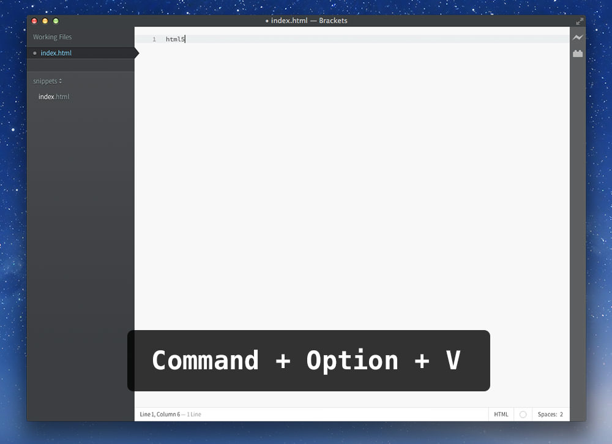
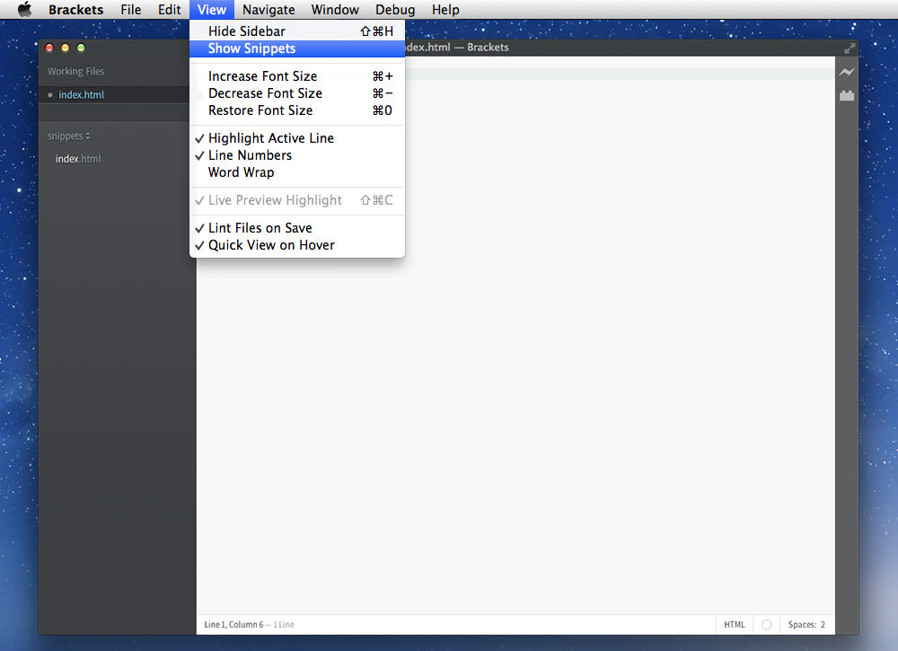
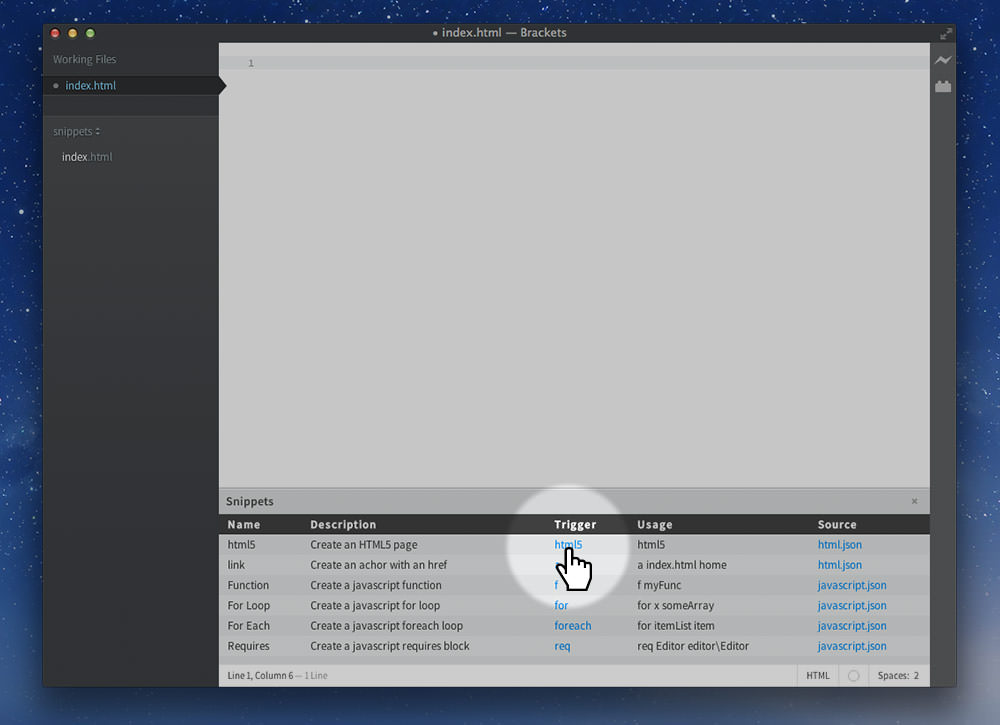
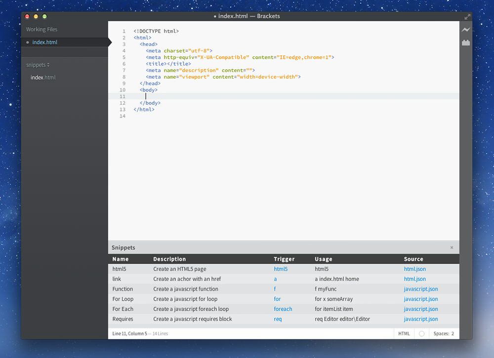

# Adobe Brackets

Adobe Brackets is an open source code editor for The Open Web.

One of its amazing features is the [Live Preview](http://www.youtube.com/watch?v=Nhvj1NYC3Uc).

**[⬇ Download Brackets](http://brackets.io/)**

---

## Set up

One feature that’s extremely helpful to install into Brackets is snippets. Brackets has support for extensions so we just need to install a snippets extension.

**1. Open the extension search panel.**

**2. Search for “snippet”. Install “Brackets Snippets” by Jonathan Rowny.**

**3. Write “html5” then trigger it with a shortcut key: `Command + Option + V`.**

**4. Or… go to the `View` menu, then select `Show Snippets`. This will pop up a little dialogue you can use to select your snippet.**

**5. Then click the trigger you want to insert.**

**6. Finally you’ll have the basic HTML snippet of code.**

