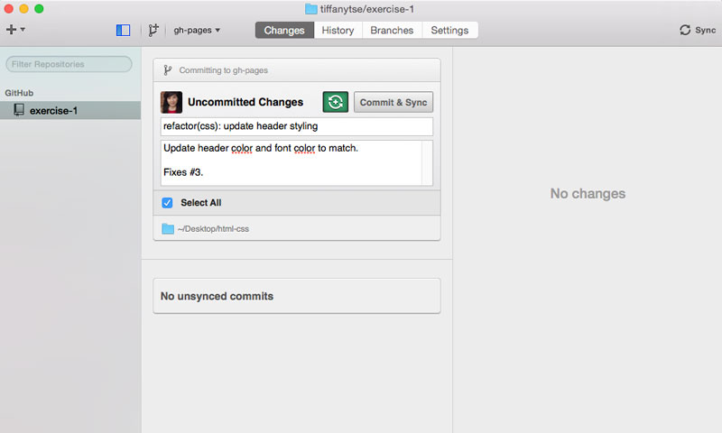

# Git Commit Guidelines

To follow best practices outline in the industry, here is an outline of how commit messages should be formatted.  This leads to **more
readable messages** that are easy to follow when looking through the **project history**.  But also, often commit messages 
will be used to **generate a change log** for releases of an application, plugin or code base. Having commit messages that follow
this formatting will prepare your code for distribution, and make formatting consistent.

## Commit Message Format
Each commit message consists of a **header**, a **body** and a **footer**.  

```
<type>(<scope>): <subject>
<BLANK LINE>
<body>
<BLANK LINE>
<footer>
```

##### How to format commits in the GitHub App



## Header 
*When you are using the GitHub App, this would be the summary input for a commit message.*
The header has a special format that includes a **type**, a **scope** and a **subject**:

Any line of the commit message cannot be longer 100 characters! This allows the message to be easier
to read on GitHub as well as in various git tools.

## Type
Must be one of the following:

* **feat**: A new feature
* **fix**: A bug fix
* **docs**: Documentation only changes
* **style**: Changes that do not affect the meaning of the code (white-space, formatting, missing
  semi-colons, etc) ** Do not confuse this with styling (css) changes. **
* **refactor**: A code change that neither fixes a bug or adds a feature
* **perf**: A code change that improves performance
* **test**: Adding missing tests
* **chore**: Changes to the build process or auxiliary tools and libraries such as documentation generation

## Scope
The scope could be anything specifying place of the commit change. For example: 

* `$location` (css) (js) (.gitignore) (readme),
* `$browser` (ie, chrome, safari)
* etc...

## Subject
The subject contains succinct description of the change:

* use the imperative, present tense: "change" **not "changed" nor "changes"**
* don't capitalize first letter
* no dot/period (.) at the end

## Body
Just as in the **subject**, use the imperative, present tense: "change" not "changed" nor "changes".
The body should include the motivation for the change and contrast this with previous behaviour. 
*When you are using the GitHub App, this would be the description input for a commit message.*

## Footer
The footer should contain any information about **Breaking Changes** and is also the place to 
reference GitHub issues that this commit **Closes**. 
*When you are using the GitHub App, this can be placed as the last line of your description created by a line-break.*

### Keywords for closing issues

The following keywords will close an issue via commit message:

* close
* closes
* closed
* fix
* fixes
* fixed
* resolve
* resolves
* resolved

See <https://help.github.com/articles/closing-issues-via-commit-messages/> for more detail on closing issues via commit messages.


